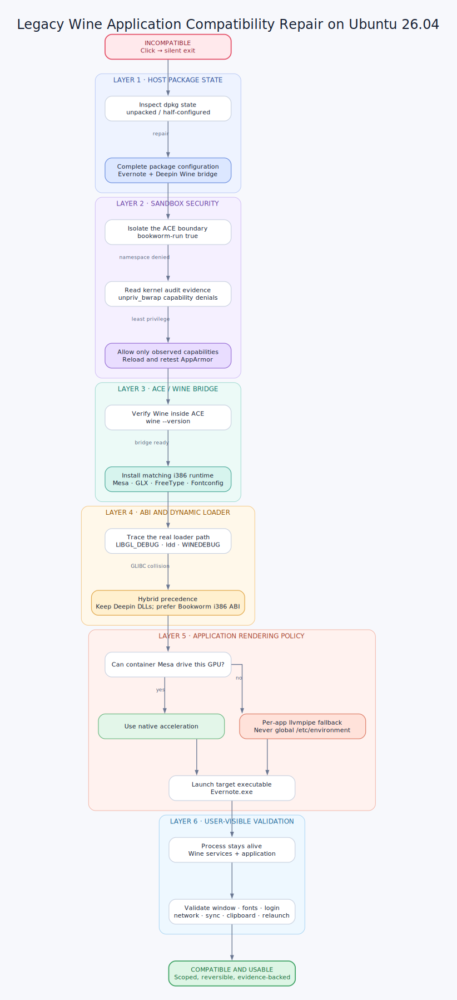

# Ubuntu 26.04 兼容性问题修复与优化 (Lenovo ThinkPad)

*English version is below.*

本项目收集了在最新的 **Ubuntu 26.04 (Resolute Raccoon) GNOME Wayland** 环境下，**Lenovo ThinkPad X1 Carbon Gen 13** 等相关机型常遇到的一些兼容性问题的技术解决方案。

## 目录结构与问题说明

### 1. Fcitx5 搜狗输入法与 Wayland 候选框兼容问题 (`fcitx5-sogou-wayland/`)
**问题：** Ubuntu 26.04 默认的 Wayland 环境下，官方搜狗输入法 (基于 X11 架构) 存在严重的崩溃或无法呼出问题。而使用 Fcitx5 时，GNOME 经常会把弹出式候选框阻挡，导致可以输入拼音却看不见选字框。
**技术路线：** 
- 完全弃用陈旧的官方客户端，改为使用现代化的 `fcitx5`。
- 利用 `scel2org5` 和 `libime_pinyindict` 两个工具，将提取的搜狗 `.scel` 词库文件直接编译成 `Fcitx5` 的底层二进制词典 `.dict`，实现词库的完美移植。
- **核心修复：** 安装 Fcitx 作者开发的官方 GNOME 扩展 `Kimpanel`。该扩展通过 D-Bus 接口接管了 Fcitx5 的候选框渲染。由于它作为 GNOME 原生扩展运行，绕过了 Wayland 对第三方弹出窗口的限制，彻底解决了选字框不出现或闪烁的 Bug。

### 2. 钉钉 (DingTalk) 无法启动问题 (`dingtalk-execstack-fix/`)
**问题：** 在 Ubuntu 26.04 等使用了更新版本 glibc 和 Linux 内核的系统上，新内核对内存安全性有更严格的要求。由于钉钉某些闭源的 C/C++ 动态链接库 (`dingtalk_dll.so` 等) 在编译时没有清除“可执行堆栈”(Executable Stack) 标记，系统会为了安全原因拒绝加载它，导致钉钉启动秒退。
**技术路线：**
- 使用 ELF 二进制修改工具 `patchelf`。
- 扫描钉钉目录下的动态库，通过 `patchelf --clear-execstack <file.so>` 指令，直接在二进制层面擦除 ELF 头部的 `PT_GNU_STACK` 可执行标记。
- 去除标记后，glibc 将允许安全加载，从而修复启动崩溃问题。

### 3. ThinkPad Fn 媒体快捷键失效问题 (`thinkpad-fn-keys-fix/`)
**问题：** 在重启系统或刚登录后，键盘顶部的音量加减、亮度调节等 Fn 快捷键完全不工作。
**技术路线：**
- 经过调试发现这是 `systemd` 在启动用户会话时的**竞态条件 (Race Condition)**。
- 处理 GNOME 媒体键的守护进程 `gsd-media-keys` 启动得比 `pipewire-pulse` 音频服务还要早。`gsd-media-keys` 试图获取默认音频输出设备时失败报错 `Unable to get default sink`，从而放弃处理音量键。
- **修复：** 在 `~/.config/systemd/user/` 中建立一个 override 配置文件，利用 `After=pipewire-pulse.service` 显式强制定义依赖关系。这能确保在音频服务准备就绪前，按键接管程序暂缓启动，从根源消除竞态。

### 4. 外置 U 盘无法挂载与 USB 无线鼠标频繁断连 (`usb-ntfs-mouse-fix/`)
**问题：** 插入 NTFS 格式外置 U 盘（含 Ventoy 盘）时，文件管理器报错无法挂载（`wrong fs type, bad option, bad superblock`）；同时 ASUS ROG OMNI 等 2.4G 无线鼠标接收器频繁断开重连。
**技术路线：**
- 内核日志显示根因是 `ntfs3: volume is dirty and "force" flag is not set!`。Ubuntu 26.04 默认用内核 `ntfs3` 挂载 NTFS，卷带 dirty 脏标志时直接拒挂；界面错误信息较为笼统。
- 鼠标侧日志可见 `usb … USB disconnect` 周期性出现，属于 USB autosuspend 将接收器休眠后唤醒失败。
- **修复（仅新增专用文件，不改 GRUB/内核参数等无关配置）：**
  - udev 规则：仅对 USB 可移动 NTFS 分区在插入时执行 `ntfsfix -d` 优先清 dirty。
  - `/etc/udisks2/mount_options.conf`：仅覆盖 NTFS，优先 `ntfs-3g`，并允许 `ntfs3` 的 `force`。
  - udev 规则：仅对 ROG OMNI 接收器 (`0b05:1ace`) 关闭 autosuspend。
- 双系统 Windows 侧提供可选 `Clear-UsbNtfsDirty.ps1`（手动运行；默认不改 Windows 系统文件）。

### 5. Spark / Deepin Wine / ACE 旧版 Windows 应用兼容方案 (`wine-ace-compatibility/`)
**案例：** 星火应用商店的印象笔记 7.2.6 在 Ubuntu 26.04 上点击后无窗口、静默退出。
**技术路线：**
- 按“宿主包状态 → AppArmor 沙箱 → ACE/Wine 桥接 → i386 依赖 → ABI 动态加载 → 应用渲染 → 行为验证”逐层定位。
- 根据内核审计日志为嵌套 Bubblewrap 添加最小 capability 集，而不是放开整个 AppArmor 配置。
- 补齐 Bookworm 容器中的 32 位 Mesa、GLX、FreeType 与 Fontconfig。
- 保留 Deepin Wine 私有 DLL，同时让 Bookworm i386 glibc/Mesa 优先，解决 ABI 冲突。
- 容器旧 Mesa 无法驱动新款 Intel 核显时，仅对目标应用启用 llvmpipe。
- 提供英文案例、只读诊断脚本、Graphviz 源文件和已渲染 SVG/PNG。

---

# Ubuntu 26.04 Compatibility Fixes (Lenovo ThinkPad)

This repository provides technical solutions for common compatibility issues encountered on **Ubuntu 26.04 (Resolute Raccoon) GNOME Wayland**, specifically tested on the **Lenovo ThinkPad X1 Carbon Gen 13**.

## Directories & Technical Explanations

### 1. Fcitx5 Sogou Wayland Candidate Box Fix (`fcitx5-sogou-wayland/`)
**Issue:** The official Sogou Input Method client relies heavily on legacy X11 and frequently crashes on Wayland. While Fcitx5 is a great alternative, GNOME Wayland's strict popup window management often causes the Fcitx5 candidate box to randomly disappear or fail to render.
**Technical Approach:** 
- Discard the legacy client and use the modern `fcitx5` framework.
- Use `scel2org5` and `libime_pinyindict` to parse Sogou's `.scel` dictionary files and compile them natively into Fcitx5 binary `.dict` formats.
- **Core Fix:** Install the `Kimpanel` GNOME extension (developed by the Fcitx author). It takes over the rendering of the candidate box via D-Bus. As a native GNOME Shell component, it bypasses Wayland's third-party popup restrictions, completely resolving the invisible candidate box bug.

### 2. DingTalk Startup Crash Fix (`dingtalk-execstack-fix/`)
**Issue:** Ubuntu 26.04 features updated glibc and kernels with stricter memory security enforcements. Certain closed-source dynamic libraries shipped with DingTalk (like `dingtalk_dll.so`) were compiled with the "Executable Stack" flag enabled. The OS denies loading these insecure libraries, causing an immediate crash on launch.
**Technical Approach:**
- Utilize `patchelf`, a utility for modifying existing ELF executables and libraries.
- Execute `patchelf --clear-execstack <file.so>` against the offending libraries to scrub the `PT_GNU_STACK` executable flag from the ELF headers.
- Once cleared, the system's dynamic loader allows execution without triggering security violations.

### 3. ThinkPad Fn Media Keys Fix (`thinkpad-fn-keys-fix/`)
**Issue:** Volume, mute, and brightness Fn keys fail to respond upon logging into the GNOME session.
**Technical Approach:**
- Investigation revealed a **race condition** in the `systemd` user session.
- The GNOME media keys daemon (`gsd-media-keys`) starts before the `pipewire-pulse` audio server is fully initialized. When `gsd-media-keys` tries to find the default sink to bind the volume keys, it fails (`Unable to get default sink`) and drops the key bindings.
- **Fix:** We inject a `systemd` user service override configuration using `After=pipewire-pulse.service`. This explicitly forces the media key daemon to wait for the audio subsystem to spin up first, completely eliminating the race condition.

### 4. External USB NTFS Mount Failure & Wireless Mouse Dropouts (`usb-ntfs-mouse-fix/`)
**Issue:** Inserting an NTFS USB stick (including Ventoy drives) fails in the file manager with a generic mount error (`wrong fs type, bad option, bad superblock`). Separately, an ASUS ROG OMNI 2.4G receiver disconnects and re-enumerates frequently.
**Technical Approach:**
- Kernel logs show `ntfs3: volume is dirty and "force" flag is not set!`. Ubuntu 26.04 defaults to the in-kernel `ntfs3` driver, which refuses dirty NTFS volumes; the GUI error message is misleading.
- Mouse logs show recurring `USB disconnect` events: USB autosuspend puts the receiver to sleep and wake/re-enumeration fails.
- **Fix (add dedicated files only; do not touch unrelated system configs such as GRUB/kernel cmdline):**
  - udev rule: on insert, run `ntfsfix -d` only for removable USB NTFS partitions.
  - `/etc/udisks2/mount_options.conf`: override NTFS only — prefer `ntfs-3g`, allow `ntfs3` `force`.
  - udev rule: disable autosuspend only for the ROG OMNI receiver (`0b05:1ace`).
- Optional Windows helper `Clear-UsbNtfsDirty.ps1` for dual-boot (manual; does not modify Windows system files by default).

### 5. Legacy Wine Application Compatibility (`wine-ace-compatibility/`)
**Case study:** Spark Store Yinxiang Biji 7.2.6 silently exited on Ubuntu 26.04.

**Technical Approach:**
- Diagnose host packages, AppArmor, ACE/Wine, i386 dependencies, ABI loader
  precedence, rendering, and visible behavior as separate layers.
- Derive the minimum Bubblewrap capability set from kernel audit evidence.
- Add the missing Bookworm i386 graphics and font runtime.
- Preserve Deepin Wine DLLs while preferring the Bookworm i386 glibc/Mesa ABI.
- Apply llvmpipe only to the affected application when container Mesa is too
  old for the host GPU.
- Includes an English case study, collector, wrapper example, Graphviz source,
  and rendered SVG/PNG flow.
